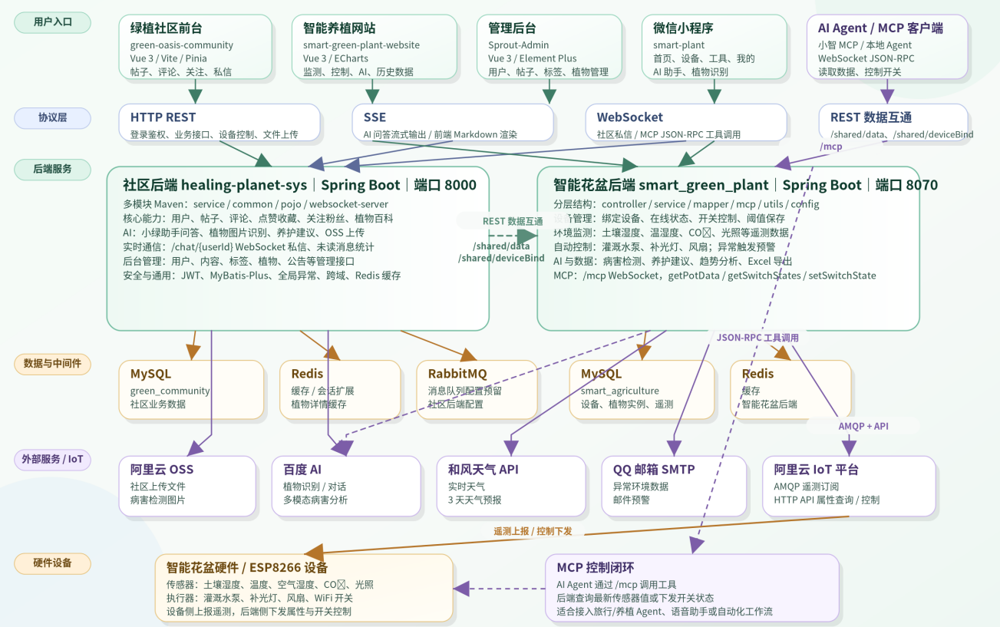

# 植愈星球 Healing Planet

> 面向绿植爱好者的智能养植与绿植社区平台。项目围绕”智能花盆硬件 + 植物养护 + 绿植社区 + AI 助手 + IoT 控制 + 后台管理”展开，提供植物信息查询、养护建议、社区内容互动、私信通知、植物识别、设备管理、环境监测、自动灌溉/补光、AI 病害检测、文件上传、后台管理等能力。

## 项目简介

植愈星球是一套前后端分离的绿植养护与社区系统，包含社区后端和智能硬件 IoT 后端两个 Spring Boot 服务。用户可以在社区中发布种植经验、浏览植物百科、关注其他用户、点赞收藏帖子、接收消息通知，通过”小绿助手”进行植物养护问答，通过图片识别辅助判断植物种类并获取养护建议；同时可以通过智能花盆实时监测土壤湿度、温度、光照等环境数据，结合阈值实现自动灌溉、补光、通风，并支持 AI 植物病害检测与邮件预警。

项目当前仓库主要包含：

* 社区后端 (healing-planet-sys, 端口 8000)：提供用户、帖子、评论、收藏、点赞、关注、通知、私信、植物库、AI 对话、文件上传、验证码、后台管理等接口。
* 智能花盆后端 (smart_green_plant, 端口 8070)：提供设备管理、环境监测、自动灌溉/补光/通风、AI 病害识别、和风天气、邮件预警、Excel 导出、MCP 协议接口。
* 社区前台：面向普通用户的绿植社区 Web 端。
* 社区管理后台：面向管理员的用户管理、内容管理、标签管理、植物管理、公告管理等页面。
* 智能养植网站：面向智能花盆/设备管理场景的 Web 端，包括首页、设备控制、AI、历史数据、用户中心、植物管理等页面。
* 微信小程序：智能绿植小程序，提供环境监测仪表盘、设备控制、AI 助手、植物识别、用户中心等功能，支持微信一键登录与账号密码登录。

## 核心功能

### 1. 绿植社区

* 用户注册、登录、登出与个人信息维护
* 拼图验证码登录校验
* 帖子列表、帖子详情、帖子发布、编辑与删除
* 评论、点赞、收藏、浏览记录
* 标签与搜索
* 用户主页、关注、粉丝、关注列表
* 消息通知与未读消息统计

### 2. 植物信息库

* 植物列表分页查询
* 按关键词搜索植物
* 植物详情查询
* 植物养护指南维护
* Redis 缓存植物详情，降低重复数据库查询
* 基于 AI 的植物图片识别与养护建议生成

### 3. 小绿助手 AI 问答

* 面向植物养护场景的 AI 对话
* 支持普通问答接口
* 支持基于 SSE 的流式输出
* 前端支持 Markdown 渲染 AI 回复
* 支持中断生成、清空对话、本地消息缓存

### 4. 私信与实时通信

* 私信发送
* 会话列表
* 历史消息分页查询
* 消息已读标记
* 未读消息统计
* WebSocket 在线通信，支持 `/chat/{userId}` 长连接

### 5. 管理后台

* 管理员登录
* 用户分页查询、新增、更新、删除
* 帖子分页查询、详情查看、修改、删除
* 标签管理
* 植物管理
* 公告管理
* 后续可扩展 AI 管理、消息管理、举报管理、数据分析、系统设置等模块

### 6. 通用能力

* 阿里云 OSS 文件上传
* 百度 AI 能力调用
* JWT 登录鉴权
* MyBatis-Plus 分页与逻辑删除
* Redis 缓存
* RabbitMQ 配置预留
* 全局异常处理
* 跨域配置

### 7. 智能花盆 IoT 控制 (smart_green_plant, 端口 8070)

* 设备管理：设备添加、删除、更新、查询，设备在线/离线状态监控
* 环境监测：土壤湿度、温度、环境湿度、CO2 浓度、光照强度实时采集，通过阿里云 IoT AMQP 协议订阅设备遥测数据
* 阈值自动控制：自定义温度、湿度、CO2、光照、土壤湿度阈值范围，超标自动开关灌溉水泵、补光灯、风扇
* 设备预警：环境数据异常时自动发送 QQ 邮件预警，同时推送系统内消息通知
* AI 植物病害检测：上传植物图片，对接自训练模型识别 38 类常见病害，结合百度 AI 多模态接口生成养护建议
* 和风天气集成：获取实时天气与 3 天天气预报，辅助养护决策
* 历史数据查询与分析：历史环境数据分页查询、趋势分析（百度 AI 数据分析）、Excel 导出
* MCP 协议支持：WebSocket 端点 `/mcp`，实现 JSON-RPC 2.0 协议，提供 `getPotData`、`getSwitchStates`、`setSwitchState` 三个工具，支持 AI Agent 远程控制花盆
* 小智 MCP 桥接：连接小智 MCP 平台，实现远程 AI Agent 透明代理控制
* 社区数据互通：通过 `/shared/data` 和 `/shared/deviceBind` 接口与社区后端联动，支持传感数据驱动的 AI 文章撰写与设备绑定

### 8. 微信小程序

* 登录：协议勾选确认、微信一键登录（wx.login）、账号密码登录
* 首页仪表盘：实时环境监测（温度、空气湿度、土壤湿度、CO2 浓度、光照强度），ECharts 七天趋势折线图（温度/湿度、光照、CO2、土壤四种数据视图切换），和风天气实时天气与三天预报
* 设备控制：ESP8266 设备在线/离线状态监控，风扇/水泵/补光灯手动开关控制，温度/湿度/CO2/光照阈值范围设置与保存，阈值自动控制开关
* AI 助手：植物养护场景对话，自定义 Markdown 解析渲染回复，本地消息缓存
* 植物识别：拍照或相册上传，对接后端植物识别接口，Markdown 渲染识别结果与养护建议
* 用户中心：用户信息展示，头像/昵称/邮箱/手机号编辑，密码修改
* 配置管理：通过 `utils/config.js` 配置 API 基础地址（`config.example.js` 模板可供参考复制）

## 技术栈

### 后端

| 技术                  | 说明           |
| ------------------- | ------------ |
| Java 8              | 后端主要开发语言     |
| Spring Boot 2.6.13  | 后端基础框架       |
| Spring MVC          | REST API 接口  |
| MyBatis-Plus        | ORM、分页、逻辑删除  |
| MySQL               | 业务数据存储       |
| Redis               | 缓存、会话相关能力扩展  |
| JWT                 | 登录状态与接口鉴权    |
| WebSocket           | 私信实时通信       |
| SSE                 | AI 流式响应      |
| 阿里云 OSS             | 文件对象存储       |
| 百度 AI               | AI 对话与植物识别能力 |
| Lombok              | 简化实体类与样板代码   |
| FastJSON / org.json | JSON 处理      |
| Hutool              | 常用工具类        |
| 阿里云 IoT SDK         | 设备属性查询、开关控制、状态获取 |
| Apache Qpid JMS      | AMQP 协议客户端，IoT 遥测订阅 |
| Spring WebFlux       | 响应式 HTTP 客户端（天气 API） |
| Spring Mail          | QQ 邮箱 SMTP 预警通知 |
| Apache POI           | Excel 数据导出 |
| Java-WebSocket       | MCP 桥接客户端 |
| MCP 协议              | AI Agent 工具协议（WebSocket 端点） |
| 和风天气 API            | 实时天气与 3 天预报 |
| Maven               | 多模块项目构建      |

### 前端

| 技术                    | 说明          |
| --------------------- | ----------- |
| Vue 3                 | 前端框架        |
| Vite                  | 前端构建工具      |
| Vue Router            | 页面路由        |
| Pinia                 | 状态管理        |
| Pinia PersistedState  | 状态持久化       |
| Axios / Fetch         | HTTP 与流式请求  |
| Element Plus          | UI 组件库      |
| ECharts / Vue ECharts | 数据可视化       |
| WangEditor            | 富文本编辑       |
| Markdown-it / marked  | Markdown 渲染 |
| Sass / SCSS           | 样式开发        |

### 小程序

| 技术                     | 说明          |
| ---------------------- | ----------- |
| 微信小程序原生框架      | 小程序基础框架，glass-easel 组件框架 |
| ECharts (ec-canvas)    | 环境数据七天趋势折线图渲染 |
| 自定义 Markdown 解析    | AI 回复 Markdown 转 HTML 渲染 |
| wx.request / wx.uploadFile | HTTP 网络请求与图片上传，token 鉴权 |
| 原生 TabBar + 分包      | 首页/设备/工具/我的 四个 Tab，UserPages 分包加载 |

## 系统架构



## 项目结构

```text
healing-planet/
├── README.md
├── SpringBoot后端/
│   ├── healing-planet-sys/
│   │   ├── pom.xml
│   │   ├── pojo/
│   │   │   ├── pom.xml
│   │   │   └── src/main/java/com/green/
│   │   │       ├── entity/        # 数据库实体类
│   │   │       ├── dto/           # 请求参数对象
│   │   │       └── vo/            # 前端返回视图对象
│   │   ├── common/
│   │   │   ├── pom.xml
│   │   │   └── src/main/java/com/green/
│   │   │       ├── common/        # 统一返回、异常处理
│   │   │       ├── config/        # OSS、百度 AI、跨域等配置
│   │   │       ├── constant/      # 常量
│   │   │       └── utils/         # 工具类
│   │   ├── websocket-server/
│   │   │   ├── pom.xml
│   │   │   └── src/main/java/com/green/
│   │   │       ├── config/        # WebSocket 配置
│   │   │       └── websocket/     # 私信 WebSocket 服务
│   │   └── service/
│   │       ├── pom.xml
│   │       └── src/main/
│   │           ├── java/com/green/
│   │           │   ├── HealingPlanetApplication.java
│   │           │   ├── controller/        # 用户端接口
│   │           │   ├── controller/admin/  # 管理端接口
│   │           │   ├── service/           # 业务接口
│   │           │   ├── serviceImpl/       # 业务实现
│   │           │   ├── mapper/            # MyBatis Mapper
│   │           │   ├── config/            # 后端配置
│   │           │   └── security/          # JWT 相关逻辑
│   │           └── resources/
│   │               └── application.yaml
│   └── smart_green_plant/
│       ├── pom.xml
│       └── src/main/
│           ├── java/com/example/demos/
│           │   ├── SmartAgricultureApplication.java
│           │   └── web/
│           │       ├── controller/           # 接口层（设备、环境数据、病害检测等）
│           │       ├── controller/shared/    # 社区数据互通接口
│           │       ├── service/             # 业务接口
│           │       ├── service/impl/        # 业务实现
│           │       ├── mapper/             # MyBatis Mapper
│           │       ├── mcp/                # MCP 协议端点 + 小智 MCP 桥接
│           │       ├── config/             # 各类配置
│           │       ├── interceptor/        # JWT 拦截器
│           │       ├── common/             # 统一返回、枚举、属性配置
│           │       ├── pojo/entity/        # 数据库实体
│           │       ├── pojo/dto/           # 请求参数对象
│           │       ├── pojo/vo/            # 返回视图对象
│           │       ├── utils/              # AMQP、百度 AI、邮件、OSS 等工具
│           │       ├── constant/           # 常量
│           │       ├── context/            # 线程上下文
│           │       ├── exception/          # 自定义异常
│           │       └── handler/            # 全局异常处理
│           └── resources/
│               ├── application.yml
│               └── application.example.yml
├── VUE前端/
│   ├── green-oasis-community/
│   │   ├── package.json
│   │   └── src/
│   │       ├── api/           # 前台接口封装
│   │       ├── assets/        # 静态资源
│   │       ├── components/    # 通用组件
│   │       ├── router/        # 前台路由
│   │       ├── stores/        # Pinia 状态管理
│   │       └── views/         # 页面视图
│   ├── smart-green-plant-website/
│   │   ├── package.json
│   │   └── src/
│   │       ├── api/
│   │       ├── assets/
│   │       ├── components/
│   │       ├── router/
│   │       ├── stores/
│   │       └── views/
│   └── Sprout-Admin/
│       ├── package.json
│       └── src/
│           ├── api/           # 管理后台接口封装
│           ├── assets/
│           ├── layout/        # 后台布局
│           ├── router/        # 后台路由
│           ├── stores/        # 管理员状态
│           └── views/         # 管理后台页面
├── smart-green-plant-mini-program/  # 微信小程序
│   ├── README.md
│   ├── images/                      # 小程序截图
│   ├── project.config.example.json  # 项目配置模板
│   ├── .gitignore                   # 忽略 config.js 等敏感文件
│   └── smart-plant/
│       ├── app.js                   # 小程序入口与全局数据
│       ├── app.json                 # 页面路由、TabBar、分包、窗口配置
│       ├── pages/
│       │   ├── index/               # 首页仪表盘（ECharts + 天气）
│       │   ├── device/              # 设备控制（开关 + 阈值设置）
│       │   ├── ai/                  # AI 助手对话
│       │   ├── tool/                # 工具箱导航
│       │   ├── plant-identify/      # 植物识别（上传 + 结果展示）
│       │   ├── login/               # 登录页（微信一键登录）
│       │   └── user/                # 用户中心
│       ├── UserPages/               # 分包
│       │   ├── edit/                # 个人信息编辑
│       │   ├── login/               # 账号密码登录
│       │   └── password/            # 密码修改
│       ├── ec-canvas/               # ECharts 微信小程序组件
│       ├── utils/
│       │   ├── config.example.js   # API 地址配置模板
│       │   ├── markdown.js         # Markdown 转 HTML
│       │   └── util.js             # 时间格式化
│       └── static/                  # 图标、天气 SVG 等静态资源
└── 原型图/
    ├── 小程序原型图.rp          # 微信小程序原型设计
    ├── 控制平台.rp              # 设备控制平台原型设计
    └── 绿植社区.rp              # 绿植社区原型设计
```

## 环境要求

### 后端环境

* JDK 8
* Maven 3.6+
* MySQL 5.7+ / 8.x（需要创建 `green_community` 和 `smart_agriculture` 两个数据库）
* Redis 6+
* 可选：RabbitMQ
* 可选：阿里云 OSS 账号
* 可选：百度 AI 相关 Key
* 可选：阿里云 IoT 平台账号（smart_green_plant 使用）
* 可选：和风天气 API Key（smart_green_plant 使用）
* 可选：QQ 邮箱 SMTP 授权码（smart_green_plant 预警邮件使用）

### 前端环境

* Node.js 20.19+ 或 22.12+ 推荐
* npm / pnpm 均可
* 浏览器建议使用 Chrome / Edge 最新版本

> 注意：`Sprout-Admin` 的 `package.json` 中明确声明了 Node 版本要求，建议使用 Node 20.19+ 或 22.12+，避免 Vite 版本不兼容。

## 本地启动

### 1. 克隆项目

```bash
git clone https://github.com/waangzh/healing-planet.git
cd healing-planet
```

### 2. 初始化数据库与中间件

本项目后端默认使用 MySQL 与 Redis。启动前需要：

1. 创建 MySQL 数据库：

```sql
CREATE DATABASE green_community DEFAULT CHARACTER SET utf8mb4 COLLATE utf8mb4_general_ci;
CREATE DATABASE smart_agriculture DEFAULT CHARACTER SET utf8mb4 COLLATE utf8mb4_general_ci;
```

2. 启动 Redis：

```bash
redis-server
```

3. 根据本地环境修改后端配置文件：

- 社区后端：`SpringBoot后端/healing-planet-sys/service/src/main/resources/application.yaml`
- 智能花盆后端：`SpringBoot后端/smart_green_plant/src/main/resources/application.yml`（参考同目录下的 `application.example.yml` 模板）

### 3. 启动后端

进入后端根目录：

```bash
cd SpringBoot后端/healing-planet-sys
```

安装依赖并编译：

```bash
mvn clean install
```

启动 `service` 模块：

```bash
mvn -pl service -am spring-boot:run
```

社区后端默认运行在：

```text
http://localhost:8000
```

### 4. 启动智能花盆后端 (smart_green_plant)

```bash
cd SpringBoot后端/smart_green_plant
mvn clean install
mvn spring-boot:run
```

智能花盆后端默认运行在：

```text
http://localhost:8070
```

### 5. 启动社区前台

```bash
cd VUE前端/green-oasis-community
npm install
npm run dev
```

### 6. 启动智能养植网站

```bash
cd VUE前端/smart-green-plant-website
npm install
npm run dev
```

### 7. 启动管理后台

```bash
cd VUE前端/Sprout-Admin
npm install
npm run dev
```

## 构建与部署

### 后端打包

社区后端：

```bash
cd SpringBoot后端/healing-planet-sys
mvn clean package -DskipTests
```

打包后可运行：

```bash
java -jar service/target/service-1.0.0.jar
```

智能花盆后端：

```bash
cd SpringBoot后端/smart_green_plant
mvn clean package -DskipTests
```

打包后可运行：

```bash
java -jar target/smart_green_plant-0.0.1-SNAPSHOT.jar
```

实际 jar 名称以 Maven 打包结果为准。

### 前端构建

社区前台：

```bash
cd VUE前端/green-oasis-community
npm run build
```

智能养植网站：

```bash
cd VUE前端/smart-green-plant-website
npm run build
```

管理后台：

```bash
cd VUE前端/Sprout-Admin
npm run build
```

构建产物一般位于各前端项目的 `dist/` 目录，可通过 Nginx 部署。

### Nginx 部署建议

可以将三个前端项目分别部署到不同路径或不同域名，例如：

```text
https://your-domain.com/community/
https://your-domain.com/plant/
https://admin.your-domain.com/
```

后端 API 可通过 Nginx 反向代理到：

```text
http://localhost:8000
```

## 常见问题

### 1. 前端请求不到后端怎么办？

检查以下内容：

* 后端是否已启动在 `8000` 端口
* 前端 `VITE_API_BASE_URL` 是否配置正确
* 后端是否允许跨域
* 浏览器控制台是否出现 CORS、401、404 或 500 错误

### 2. 登录后仍然跳转登录页怎么办？

检查：

* 后端登录接口是否返回 token
* 前端 Pinia 是否正确保存 token
* 请求头中是否携带 `Authorization`
* JWT Secret 与解析逻辑是否一致

### 3. AI 对话没有返回怎么办？

检查：

* 百度 AI Key 是否配置正确
* 后端 `/common/chat/stream` 是否可访问
* 浏览器是否支持 SSE 流式响应
* Nginx 是否关闭了响应缓冲
* 后端日志是否出现第三方 API 调用异常

### 4. 图片上传失败怎么办？

检查：

* OSS AccessKey、Endpoint、Bucket 是否正确
* 文件大小是否超过后端限制
* Bucket 权限是否允许上传和访问
* 服务器网络是否能访问 OSS 服务

---

**植愈星球 Healing Planet** —— 让科技走进生活，让植物温暖人心。
