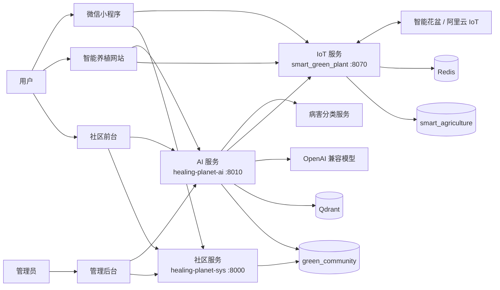

# 植愈星球 Healing Planet

> 面向绿植爱好者的智能养植平台：把绿植社区、智能花盆与可追溯的 AI 养护助手放在同一套系统中。

[中文](README.md) | [English](README.en.md)

## 项目概览

植愈星球由三个后端服务和多个客户端组成。用户可以记录与交流养植经验、管理智能花盆、查看环境数据，并获得结合知识库、社区内容和设备状态的 AI 辅助建议。

| 模块 | 主要能力 |
| --- | --- |
| 绿植社区 | 用户、帖子、评论、关注、私信、植物库、通知与后台内容管理 |
| 智能花盆 IoT | 设备绑定、环境监测、阈值自动控制、预警、天气与历史数据分析 |
| AI 服务 | 混合 RAG 检索、证据引用、个体化状态感知、多模态病害辅助分析 |

客户端包括社区前台、智能养植网站、管理后台和微信小程序。

## 系统架构



AI 服务独立部署：它从社区数据构建知识索引，按需向 IoT 服务获取植物实时状态，并在回答中返回可追溯证据；它不执行设备控制操作。

AI 查询链路采用 Evidence-first RAG：`Query Analysis → Entity Resolution → Retrieval Planning → Broad Retrieval → Evidence Selection → Answerability → Generation`。用户明确禁止的来源、权限、安全规则和实体冲突保持硬约束；领域、主题与来源相关性预测只作为检索和排序信号。每个 `REQUIRED` 来源必须分别提供相关 Evidence，同一请求的检索、reranker、Answerability 与生成共享一个不可变运行时配置快照。

## 仓库结构

```text
healing-planet/
├── SpringBoot后端/
│   ├── healing-planet-sys/        # 社区服务（8000）
│   ├── smart_green_plant/         # IoT 服务（8070）
│   └── healing-planet-ai/         # RAG / 多模态 AI 服务（8010）
├── VUE前端/
│   ├── green-oasis-community/     # 社区前台
│   ├── smart-green-plant-website/ # 智能养植网站
│   └── Sprout-Admin/              # 管理后台
├── smart-green-plant-mini-program/ # 微信小程序
├── rag-eval/                      # AI RAG 评估集与脚本
└── 原型图/                         # Axure 原型
```

## 快速启动

### 1. 准备环境

- 社区服务：JDK 8、Maven；AI 服务：JDK 17、建议 Maven 3.9+
- IoT 目录当前没有可验证的 `pom.xml` 或 `build.gradle`，需使用原项目部署环境，不能直接套用下方 Maven 命令
- Web 前端：Node.js；`Sprout-Admin` 明确要求 `^20.19.0 || >=22.12.0`
- 包管理器：社区前台与管理后台使用 npm，智能养植网站使用 pnpm
- MySQL、Redis；启动 AI 服务还需要 Docker / Qdrant 与 OpenAI 兼容的聊天、Embedding 服务

创建业务数据库：

```sql
CREATE DATABASE green_community DEFAULT CHARACTER SET utf8mb4;
CREATE DATABASE smart_agriculture DEFAULT CHARACTER SET utf8mb4;
```

### 2. 配置服务

所有真实密钥和本地地址都应只写入本地配置或部署环境，切勿提交到仓库。

| 服务 | 配置入口 | 关键依赖 |
| --- | --- | --- |
| 社区服务 | `SpringBoot后端/healing-planet-sys/service/src/main/resources/application.example.yaml` | MySQL、Redis、OSS、鉴权与第三方 AI 配置 |
| IoT 服务 | `SpringBoot后端/smart_green_plant/src/main/resources/application.example.yml` | MySQL、Redis、阿里云 IoT、天气、邮件等 |
| AI 服务 | `SpringBoot后端/healing-planet-ai/.env.example` 与 `src/main/resources/application.example.yml` | `green_community`、Qdrant、聊天模型、Embedding、内部 API 密钥 |
| 小程序 | `smart-green-plant-mini-program/smart-plant/utils/config.example.js` | 后端 API 地址 |

AI 服务读取 IoT 状态时，两端须配置相同的内部 API 密钥：AI 侧 `PLANT_STATE_API_KEY`、IoT 侧 `PLANT_INTERNAL_API_KEY`。`RAG_INTERNAL_API_KEY` 单独保护 AI 服务的 `/internal/**` 索引与配置接口；生产环境还应在网关层限制这些接口仅供内部访问。

### 3. 启动后端

先启动 MySQL、Redis；若使用 AI 服务，再启动 Qdrant：

```bash
cd SpringBoot后端/healing-planet-ai
docker compose up -d qdrant
```

仓库中可直接验证的后端启动命令如下；请从仓库根目录分别在独立终端执行：

```bash
# 社区服务（:8000）
cd SpringBoot后端/healing-planet-sys
mvn -pl service -am spring-boot:run

# AI 服务（:8010；先按 .env.example 注入所需环境变量）
cd ../healing-planet-ai
mvn spring-boot:run
```

IoT 服务源码位于 `SpringBoot后端/smart_green_plant`，默认端口为 `8070`；当前仓库未包含可验证的根级构建描述文件，因此 README 不提供未经验证的启动命令。

首次启用 AI 检索时，按 [AI 服务说明](SpringBoot后端/healing-planet-ai/README.md) 执行数据库迁移并触发索引；该文档也包含 API、可观测性和部署细节。

### 4. 启动前端

三个 Web 客户端是独立项目，请使用各自的锁文件和包管理器：

```bash
# 社区前台
cd VUE前端/green-oasis-community
npm ci
npm run dev

# 智能养植网站
cd ../smart-green-plant-website
pnpm install --frozen-lockfile
pnpm run dev

# 管理后台
cd ../Sprout-Admin
npm ci
npm run dev
```

微信小程序请使用微信开发者工具导入 `smart-green-plant-mini-program`，再按模板配置 AppID、请求域名与 API 地址。

## 开发与验证

```bash
# AI 服务单元测试
cd SpringBoot后端/healing-planet-ai
mvn test

# 社区服务单元测试
cd ../healing-planet-sys
mvn -pl service -am test

# 社区前台构建验证
cd ../../VUE前端/green-oasis-community
npm ci
npm run build

# 智能养植网站构建验证
cd ../smart-green-plant-website
pnpm install --frozen-lockfile
pnpm run build

# 管理后台构建验证
cd ../Sprout-Admin
npm ci
npm run build
```

AI RAG 的离线评估脚本、数据集和历史报告位于 `rag-eval/`；使用方式见 [rag-eval/README.md](rag-eval/README.md)。

## 相关文档

- [AI 服务说明](SpringBoot后端/healing-planet-ai/README.md)：RAG、多模态诊断、索引接口、监控与部署
- [小程序说明](smart-green-plant-mini-program/README.md)：小程序页面与配置
- [私信接口说明](SpringBoot后端/healing-planet-sys/PRIVATE_CHAT_API.md)

## 安全提示

- 不要提交数据库密码、LLM / 云服务密钥、JWT 密钥或邮箱授权码。
- 为数据库账户按服务最小化授权；AI 服务仅需读取业务知识并写入其 RAG 状态表。
- 将 Qdrant、Prometheus、Grafana 与 Actuator 管理接口置于受限网络中，避免直接暴露到公网。
