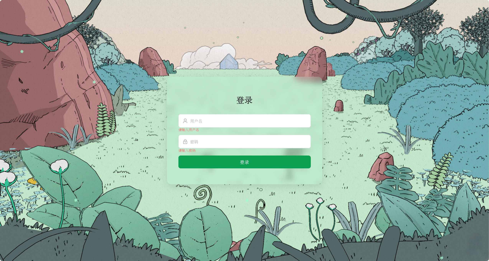
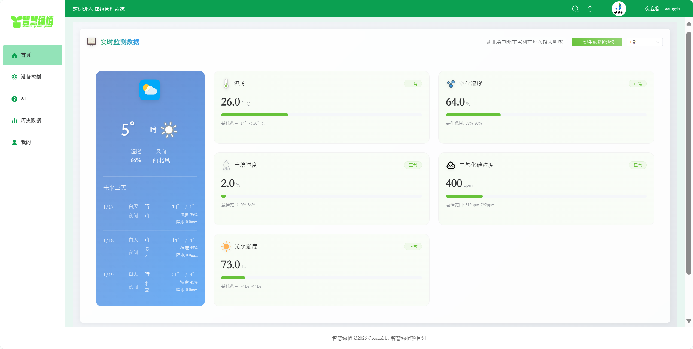
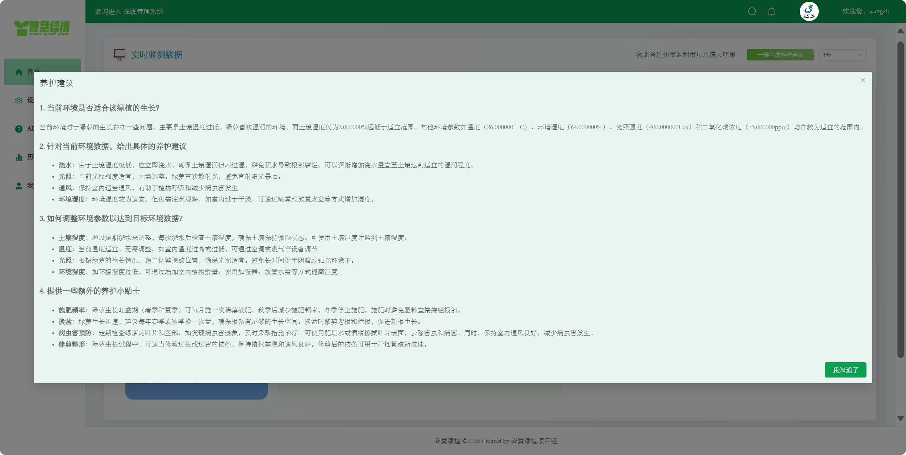
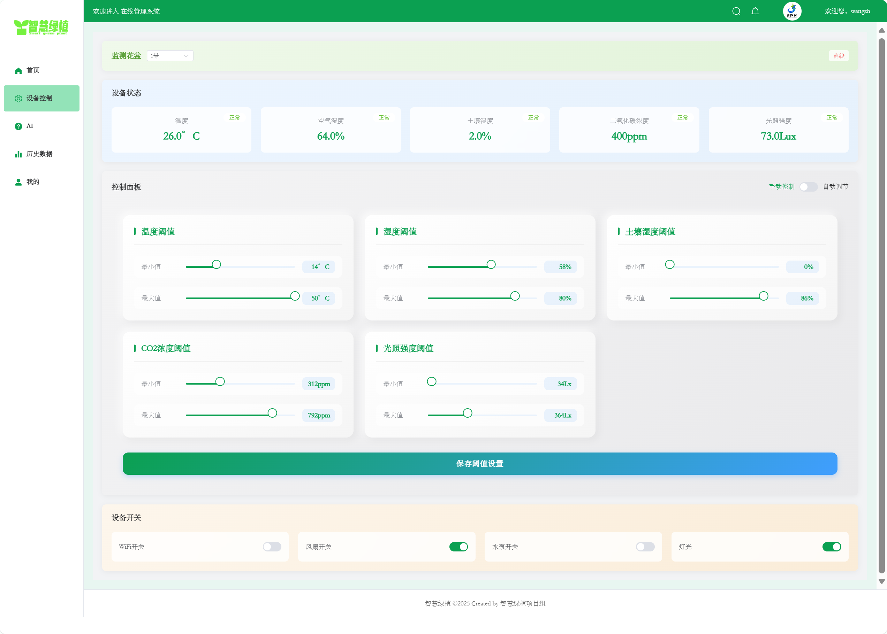
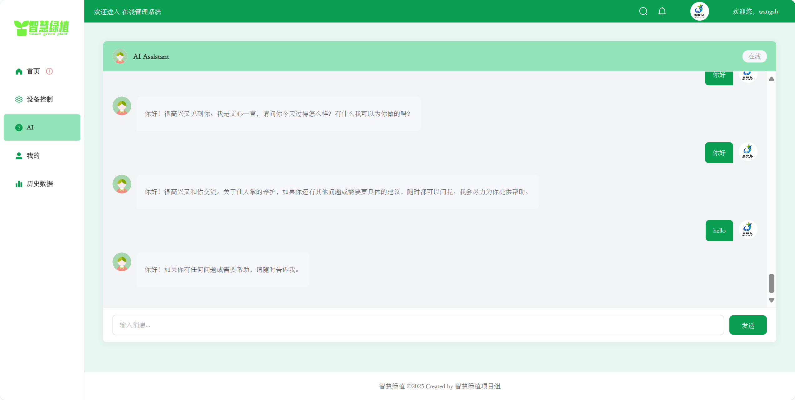
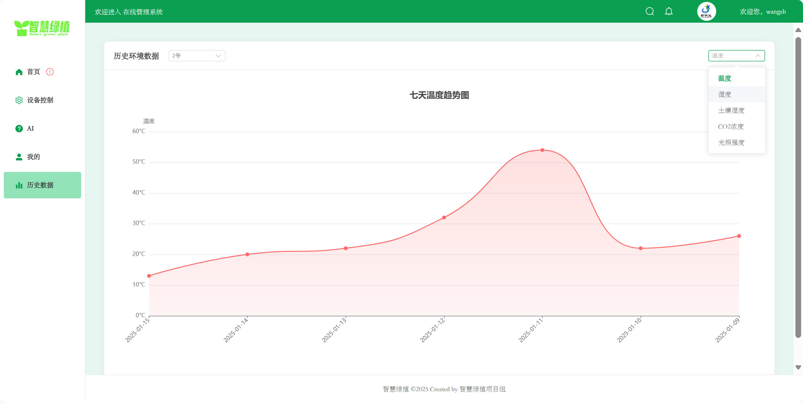
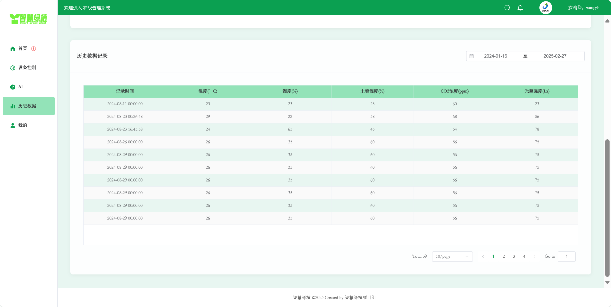
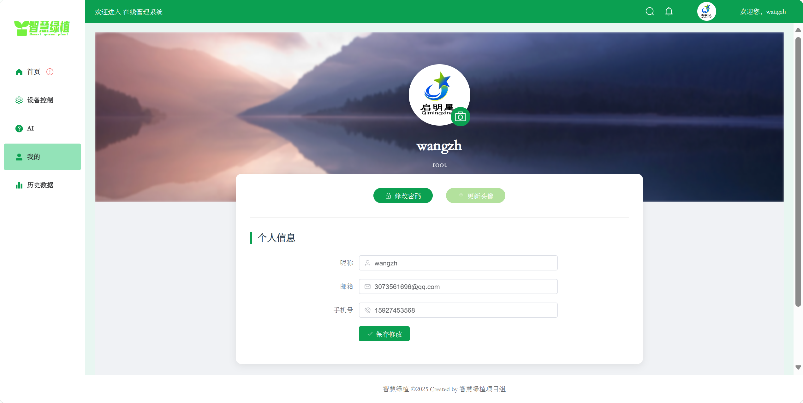

# smart-green-plant-website

智能养植网站 -- Smart plant monitoring and control dashboard.

## Recommended IDE Setup

[VSCode](https://code.visualstudio.com/) + [Volar](https://marketplace.visualstudio.com/items?itemName=Vue.volar) (and disable Vetur).

## Project Setup

```sh
npm install
```

### Compile and Hot-Reload for Development

```sh
npm run dev
```

### Compile and Minify for Production

```sh
npm run build
```

## Screenshots

## 登录页面

## 首页

## 养护建议

## 设备控制

## AI页面

## 历史数据

## 历史数据分页表

## 个人信息

